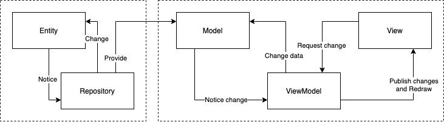

# Welcome => RecipeApp MVVM-RxSwift with Data Domain

Architecture: MVVM with Data Domain
 - Entity
 - Repository

App Domain
 - Model
 - ViewModel
 - View (ViewController)

Trade-off analysis:
 1. This architecture is more simple than VIPER, yet it covers all of app needs.
 2. Based on my experience, Junior Developers who have no knowledge about clean
architecture and Reactive Programming, they take a longer time to understand this
architecture.

UI: UIKit (no storyboard) to support < iOS 13

I select the third-party libraries based on the number of contributors to make sure that the
framework will always be maintained.
